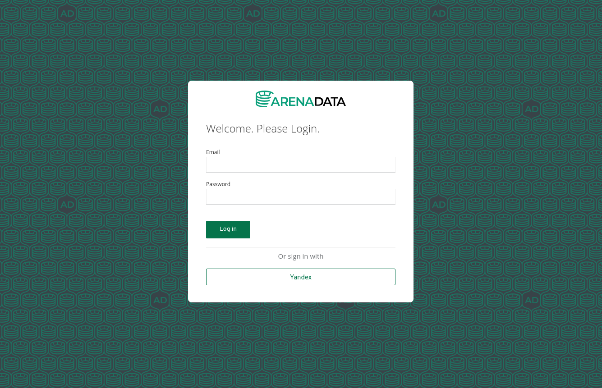

# Arenadata Keycloak Customization



Includes:

- Yandex identity provider with `hostedDomain` parameter support;
- corporate login theme;
- Dockerfile to build application image in Quarkus style.

## How to build

Just run `make build`. The `Makefile` contains a set of environment variables
to customize the image. Use can change the values when calling `make` or use
`.env` file (recommended).

Use the following environment variables to customize build:

  - `KC_DB`: the type of database
  - `KC_DB_URL`: database jdbc URL
  - `KC_DB_USER`: database user
  - `KC_DB_PASSWORD`: database password
  - `IMAGE`: Docker image name
  - `KC_ARGS`: additional parameters for `start` or `start-dev` command
## How to run

When developing, just run `make start` or `make start-dev` with the parameters
you need.

To run with `docker-compose`, use the following configuration:

```
version: "3"
services:
  keycloak:
    image: hub.adsw.io/library/keycloak-arenadata:17-0.1.0
    environment:
      KC_DB_URL: "jdbc:postgresql://hostname:port/database"
      KC_DB_USERNAME: user
      KC_DB_PASSWORD: password
    ports:
      - 8080:8080
    command: start --http-enabled=true --proxy=edge --hostname-strict=false
```

You can tune some build parameters (e.g. add new plugins or change URI path 
prefix) in `--auto-build` mode, for example:

```
    command start --auto-build --db=postgres --http-relative-path=/auth
```

Use `--auto-build` only in debug or quick fix mode, for production it's better
to rebuild optimized container using Dockerfile.

